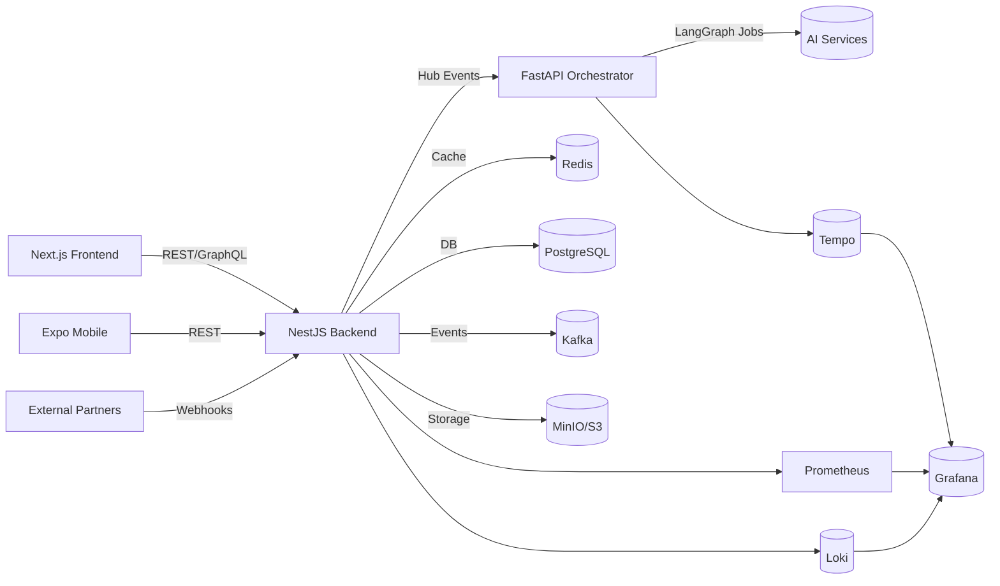

# Health Tourism AI Platform (Synchron AI Hub)

Synchron AI Hub is a multi-tenant orchestration platform for cross-border health tourism. The monorepo combines a NestJS backend, LangChain-powered AI services, and a complete observability stack to coordinate patients, agents, and partners while preserving KVKK/GDPR compliance.

---

## Monorepo Overview

| Path | Description |
|------|-------------|
| `backend/` | NestJS core (HubCore modules, tenant APIs, event orchestration) |
| `frontend/` | Next.js 14 patient & operator console |
| `mobile/` | Expo mobile companion app |
| `ai-services/` | FastAPI microservices (orchestrator, NLP, speech, vision, personalization) |
| `shared/` | Reusable DTOs, validation schemas, tooling |
| `infrastructure/` | Docker Compose & Kubernetes manifests (infra, backend, AI namespaces) |
| `monitoring/` | Prometheus, Tempo, Grafana, Loki configuration |

### Stack Composition

| Layer | Tech | Notes |
|-------|------|-------|
| Frontend | Next.js 14, React 18, Tailwind | Serves operators, clinics, and patients |
| Backend | NestJS 10, TypeORM, Redis Cache | HubCore, RBAC/ABAC, orchestration endpoints |
| AI Services | FastAPI, LangChain, Qdrant, Neo4j | LangGraph workflows, speech/vision adapters |
| Data Plane | PostgreSQL 15, Redis 7, Kafka 7.5, MinIO | Shared across tenants with strict key isolation |
| Infrastructure | Docker Compose, Kubernetes (EKS/GKE), ArgoCD | IaC for local, staging, and production |
| Monitoring | Prometheus, Tempo, Loki, Grafana | Tenant-aware metrics, traces, logs |

---

## Quick Start

1. **Install dependencies**
   ```bash
   yarn install
   yarn workspaces run install
   ```
2. **Seed local env files**
   ```bash
   cp .env.example .env.local
   cp backend/.env.example backend/.env.local
   cp ai-services/.env.example ai-services/.env.local
   cp ai-services/orchestrator-svc/.env.example ai-services/orchestrator-svc/.env.local
   ```
3. **Launch core infrastructure**
   ```bash
   yarn docker:up
   ```
4. **Start backend & AI orchestrator**
   ```bash
   yarn dev:backend   # http://localhost:4000
   yarn dev:ai        # http://localhost:8080
   ```
5. **(Optional) Start frontend**
   ```bash
   cd frontend && yarn dev
   ```

---

## Observability Endpoints

| Component | URL | Purpose |
|-----------|-----|---------|
| Prometheus | `http://localhost:9090` | Scrapes backend `/metrics` and `/hub/metrics`, AI exporters |
| Tempo | `http://localhost:4318` (OTLP), `:4319` (traces) | Distributed tracing with `tenant_id` search |
| Grafana | `http://localhost:3001` | Dashboards pre-provisioned with `$tenant_id` filters |
| Loki | `http://localhost:3100` | Centralised JSON logs from backend & AI services |
| Redis Exporter | `http://localhost:9121/metrics` | Cache performance |
| Postgres Exporter | `http://localhost:9187/metrics` | DB health |

---

## Security & Compliance

- **Tenant Isolation** – `X-Tenant` enforcement, tenant-aware repositories, Redis namespacing (`tenant:{tenantId}:*`), per-tenant rate limiting & idempotency.
- **Data Protection** – AES-256-GCM envelope encryption (`FIELD_ENCRYPTION_KEY`), TLS enforced for managed databases, opt-in row-level masking.
- **Audit & Governance** – Pino structured logs with PII redaction, audit events persisted and exported to Loki/Tempo, retention aligned with KVKK/GDPR guidance.
- **Access Controls** – JWT scopes + ABAC policies, OnlyChannel & Doktor365 credentials stored via secret managers per environment.

---

## Architecture Flow



---

## Deployment Notes

- **Local** – `yarn docker:up` spins up all infra & monitoring services; `yarn dev` runs backend + frontend + AI orchestrator concurrently.
- **Staging / Production** – GitHub Actions (`deploy-staging.yml`, `deploy-production.yml`) build/push images to GHCR and trigger ArgoCD sync. Kubernetes manifests under `infrastructure/kubernetes/` define namespaces (`backend`, `ai`, `infra`, `monitoring`) and observability wiring.
- **Smoke Tests** – `tenant-validation.yml` brings up Docker compose, launches backend and orchestrator, executes tenant smoke spec, gathers `/hub/metrics`, publishes Swagger artifacts for review.

---

## Command Reference

```bash
yarn dev             # frontend + backend + AI orchestrator
yarn dev:backend     # backend only
yarn dev:ai          # orchestrator service
yarn docker:up       # start infra stack
yarn docker:down     # shutdown infra stack
yarn test:backend    # backend tests
yarn lint            # lint monorepo
yarn build           # build NestJS backend
```
