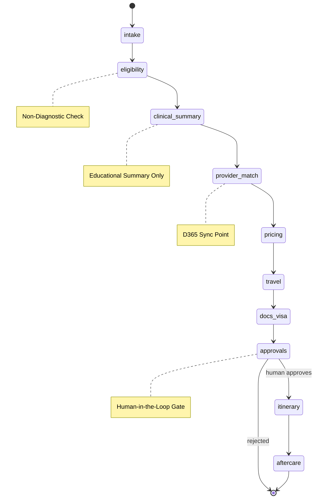

# 🤖 Agents & FSM – Health Tourism AI Platform (Version 3.0 / October 2025)

> **NON-DIAGNOSTIC DISCLAIMER:**  
> All AI outputs are **strictly educational** and intended for administrative or coordination support.  
> Every clinical decision must be reviewed and validated by licensed physicians.  
> The system includes built-in guardrails to reject any form of diagnosis or treatment prescription.

---

## 🧠 Orchestrator FSM (LangGraph v2)

### State Machine Diagram



---

## 🧩 Nodes & Responsibilities (v3 Enhanced)

| Node | Purpose | Key Guardrails | D365/External Integration |
|------|---------|----------------|--------------------------|
| **intake** | Normalize intake payloads and detect early red flags | Mask PHI; redact sensitive notes | - |
| **eligibility** | Evaluate non-diagnostic health and travel eligibility | Ban medical/diagnostic phrasing | RAG query with Qdrant |
| **clinical_summary** | Generate coordination summary for case overview | Include disclaimers; redact drug references | - |
| **provider_match** | Rank and match providers/packages by specialty | Enforce tenant boundaries | **D365: GET /deals**, sync providers |
| **pricing** | Generate transparent treatment and travel cost breakdowns | Validate currency conversion | **D365: POST /deals/note** |
| **travel** | Suggest flight and accommodation options | Rate-limit Amadeus API | **Amadeus API** (Circuit Breaker) |
| **docs_visa** | Prepare visa/document checklist | Prevent persistent URLs | MinIO presigned URLs |
| **approvals** | Trigger `approval_required` event | Pause FSM; await Ops decision | Kafka: `approval.required` |
| **itinerary** | Build confirmed itinerary | Validate timezone sequencing | **D365: POST /ai/send-flight-data** |
| **aftercare** | Initiate post-op follow-up workflows | Generate personalized reminders | WhatsApp Cloud API |

---

## 🧠 Memory & Checkpointing (v3 Canonical Keys)

### Redis Checkpointing

LangGraph persists FSM states using **v3 canonical keys**:

```
lg:ckpt:{caseId}                    # LangGraph checkpoint (TTL: 7d)
case:state:{caseId}                 # Backend-exposed state cache (TTL: 1h)
case:lock:{caseId}                  # Processing lock (TTL: 5m)
```

**Data Structure:**
```json
{
  "caseId": "650e8400-e29b-41d4-a716-446655440002",
  "current_state": "pricing",
  "history": ["intake", "eligibility", "clinical_summary", "provider_match"],
  "metadata": {
    "tenant_id": "clinic-123",
    "patient_id": "550e8400",
    "d365_deal_id": "D365-2025-4521",
    "idempotency_key": "idem:abc123"
  },
  "checkpoint_data": {
    "provider_matches": [...],
    "eligibility_score": 0.92,
    "circuit_breaker_status": {
      "amadeus": "closed",
      "d365": "closed"
    }
  },
  "updated_at": "2025-10-09T12:33:00Z",
  "expires_at": "2025-10-16T12:33:00Z"
}
```

**Redis Commands:**
```bash
# Save checkpoint (v3 key format)
SETEX lg:ckpt:650e8400 604800 '{"current_state": "pricing", ...}'

# Retrieve checkpoint
GET lg:ckpt:650e8400

# Check idempotency
SETNX idem:abc123 "1" EX 3600

# List all active FSM sessions
KEYS lg:ckpt:*
```

---

## 🔄 Event-Driven Integration (v3 Topics)

### Kafka/RabbitMQ Event Flow

| Event Topic | Producer | Consumer | When |
|------------|----------|----------|------|
| `case.created` | Backend | Orchestrator | New intake submitted |
| `approval.required` | Orchestrator | Ops Console | Red flag detected |
| `payment.succeeded` | Payment GW | Backend | Payment confirmed |
| `doc.uploaded` | Frontend | Backend/Docs | Document received |
| `quote.accepted` | Backend | Orchestrator | Move to itinerary |

### Event Schema with Idempotency

```json
{
  "id": "evt_650e8400",
  "type": "approval.required",
  "timestamp": "2025-10-09T10:27:00Z",
  "idempotency_key": "idem:task-789",
  "correlation_id": "650e8400",
  "tenant_id": "clinic-123",
  "payload": {
    "task_id": "task-789",
    "case_id": "650e8400",
    "reason": "BMI > 35 requires physician review",
    "urgency": "medium"
  }
}
```

---

## 🔌 External Service Integration

### Doktor365 Integration Points

```python
# orchestrator/tools/d365.py
class D365Tool:
    @circuit_breaker(timeout=5000, error_threshold=50)
    async def get_deal(self, deal_id: str) -> dict:
        """Fetch deal from D365 with circuit breaker"""
        headers = {"Authorization": f"Bearer {await self.get_token()}"}
        return await self.http.get(f"/patient/deals/{deal_id}", headers=headers)
    
    @idempotent(key_prefix="d365:note")
    async def add_note(self, deal_id: str, note: str) -> dict:
        """Add note to D365 deal (idempotent)"""
        return await self.http.post(f"/patient/deals/note", {
            "dealId": deal_id,
            "note": note
        })
    
    async def send_flight_data(self, deal_id: str, flight_data: dict) -> dict:
        """Send confirmed flight to D365"""
        return await self.http.post("/patient/ai/send-flight-data", {
            "dealId": deal_id,
            "flightData": flight_data
        })
```

### Circuit Breaker Configuration

```python
# orchestrator/config/resilience.py
CIRCUIT_BREAKERS = {
    "d365": {
        "timeout": 5000,
        "error_threshold": 50,
        "reset_timeout": 30000,
        "fallback": lambda: {"status": "unavailable", "cached": True}
    },
    "amadeus": {
        "timeout": 8000,
        "error_threshold": 60,
        "reset_timeout": 60000
    },
    "payment_gateway": {
        "timeout": 10000,
        "error_threshold": 30,
        "reset_timeout": 120000
    }
}
```

---

## 👩‍⚕️ Human-in-the-Loop Operations (v3 Enhanced)

### Trigger Flow with Idempotency

1. **Orchestrator emits** `approval_required` event with `idempotency_key`
2. **Backend checks** Redis `SETNX idem:{key}` to prevent duplicates
3. **Pushes to** Kafka topic if not duplicate
4. **Ops Console consumes** and displays pending task

### Ops Console API (v3)

**1. Get pending approvals:**
```
GET /cases/pending-approvals?tenant_id=clinic-123
X-Request-ID: req_xyz789
```

**2. Submit approval decision (idempotent):**
```
POST /cases/{caseId}/approvals/{taskId}
X-Idempotency-Key: approval_task-789_operator-123
```

**Request:**
```json
{
  "decision": "APPROVED",
  "comment": "BMI within acceptable range",
  "reviewer_id": "operator-123",
  "d365_deal_id": "D365-2025-4521"
}
```

**3. Backend resumes FSM:**
```python
# backend/src/modules/ai-bridge/orchestrator.service.ts
async resumeOrchestration(caseId: string, decision: string) {
  // Check idempotency
  const key = `idem:resume:${caseId}`;
  if (!await this.redis.setnx(key, '1', 'EX', 3600)) {
    return { status: 'already_processing' };
  }
  
  // Call orchestrator
  return await this.http.post('/orchestrate/resume', {
    case_id: caseId,
    decision: decision
  });
}
```

---

## 🚨 Fail-Safe Mechanisms (v3)

### Enhanced Safety Matrix

| Check Type | Implementation | v3 Enhancement |
|------------|---------------|----------------|
| **Non-Diagnostic Enforcement** | Regex + LLM moderation | Added to every node output |
| **PII Scrubbing** | AES-GCM + hash indexes | Applied before checkpoint save |
| **Idempotency** | Redis SETNX | All state transitions |
| **Circuit Breaking** | Opossum/py-breaker | All external calls |
| **Rate Limiting** | Redis counters | Per tenant + global |
| **Consent Validation** | KVKK Article 9 check | Blocks FSM start without consent |

### Retry & DLQ Pattern

```python
# orchestrator/core/retry.py
@retry(
    stop=stop_after_attempt(3),
    wait=wait_exponential(multiplier=1, min=4, max=10),
    retry=retry_if_exception_type(TransientError)
)
async def call_external_service(self, service_name: str, *args):
    try:
        return await self.services[service_name](*args)
    except Exception as e:
        # Send to DLQ after final retry
        await self.send_to_dlq({
            'service': service_name,
            'error': str(e),
            'timestamp': datetime.utcnow()
        })
        raise
```

---

## 🧩 Example FSM Trace (v3)

### Case: #CSE-4521 (tenant: clinica-istanbul)

```
-------------------------------------------------
[2025-10-09T10:22:00Z] intake → eligibility ✅
  Duration: 2.1s
  Idempotency: idem:intake_4521
  
[2025-10-09T10:24:01Z] eligibility → clinical_summary ✅
  Duration: 4.3s
  RAG Query: "dental implant eligibility"
  
[2025-10-09T10:25:05Z] clinical_summary → provider_match ✅
  Duration: 3.8s
  D365 Call: GET /deals (Circuit: CLOSED)
  Matched: 3 providers
  
[2025-10-09T10:27:00Z] provider_match → pricing ⚙️
  Duration: 2.5s
  D365 Call: POST /deals/note (Idempotent)
  
[2025-10-09T10:27:00Z] pricing → PAUSED ⏸️
  Event: approval.required
  Task ID: task-789
  Idempotency: idem:approval_789
  
[2025-10-09T11:10:34Z] APPROVAL RECEIVED ✅
  Decision: APPROVED
  Idempotency Check: Passed
  
[2025-10-09T11:11:10Z] pricing → travel ✅
  Duration: 1.8s
  Amadeus Call: (Circuit: CLOSED)
  
[2025-10-09T11:13:22Z] travel → docs_visa ✅
  Duration: 2.1s
  MinIO: 3 presigned URLs generated
  
[2025-10-09T11:15:45Z] docs_visa → itinerary ✅
  Duration: 3.2s
  D365 Call: POST /ai/send-flight-data
  
[2025-10-09T11:16:00Z] itinerary → aftercare ✅
  Duration: 0.8s
  WhatsApp: Template sent
-------------------------------------------------
Total Duration: 54 minutes (48m paused)
Circuit Breaker Status: All CLOSED
Idempotency Violations: 0
```

---

## 📡 Observability (v3 Metrics)

### Prometheus Metrics

```prometheus
# FSM metrics
fsm_transition_total{state="pricing",tenant="clinica-istanbul"} 42
fsm_node_duration_seconds{node="provider_match",tenant="clinica-istanbul"} 3.8

# Circuit breaker metrics
circuit_breaker_state{service="d365",state="closed"} 1
circuit_breaker_failures_total{service="amadeus"} 2

# Idempotency metrics
idempotency_duplicates_total{endpoint="/approvals"} 5
idempotency_cache_hits_total 127

# D365 integration metrics
d365_api_calls_total{endpoint="/deals",method="GET"} 156
d365_api_latency_seconds{endpoint="/deals/note"} 1.2

# Event metrics
events_published_total{topic="approval.required"} 12
events_consumed_total{topic="case.created"} 38
```

### Grafana Dashboards (v3)

1. **FSM Overview**
   - State distribution
   - Average completion time
   - Idempotency hit rate

2. **D365 Integration**
   - API call volume
   - Success/failure rates
   - Circuit breaker status

3. **Resilience Metrics**
   - Circuit breaker states
   - Retry attempts
   - DLQ depth

4. **Event Flow**
   - Topic throughput
   - Processing lag
   - Dead letter queue size

---

## 🔧 Configuration (v3)

### Environment Variables

```bash
# LangGraph Configuration
LANGGRAPH_CHECKPOINT_STORE=redis
REDIS_CHECKPOINT_URL=redis://redis:6379/1

# D365 Integration
D365_BASE_URL=https://api.doktor365.com
D365_CLIENT_ID=xxx
D365_CLIENT_SECRET=yyy
D365_TIMEOUT=5000

# Circuit Breakers
CIRCUIT_BREAKER_TIMEOUT=5000
CIRCUIT_BREAKER_ERROR_THRESHOLD=50
CIRCUIT_BREAKER_RESET_TIMEOUT=30000

# Idempotency
IDEMPOTENCY_KEY_TTL=3600
IDEMPOTENCY_DUPLICATE_STATUS=409

# Event Bus
KAFKA_BROKERS=kafka:9092
KAFKA_CONSUMER_GROUP=orchestrator

# Observability
OTEL_EXPORTER_OTLP_ENDPOINT=http://tempo:4318
PROMETHEUS_PUSHGATEWAY_URL=http://prometheus:9091
```

---

## 🧪 Testing (v3)

### Integration Tests

```python
def test_d365_integration():
    """Test D365 API integration with circuit breaker"""
    # Simulate D365 failure
    mock_d365_failure()
    
    # Verify circuit opens
    assert circuit_breaker.state("d365") == "OPEN"
    
    # Verify fallback response
    result = await get_deal("test-deal")
    assert result["cached"] == True

def test_idempotency():
    """Test idempotent operation handling"""
    key = "test-idem-key"
    
    # First call succeeds
    result1 = await process_with_idempotency(key)
    assert result1["status"] == "success"
    
    # Second call returns cached
    result2 = await process_with_idempotency(key)
    assert result2 == result1
```

---

## ✅ Summary

- ✅ **LangGraph FSM with v3 canonical Redis keys**
- ✅ **Doktor365 integration** at provider_match, pricing, and itinerary nodes
- ✅ **Circuit breakers** on all external services (D365, Amadeus, Payment)
- ✅ **Idempotency enforcement** on all state transitions and webhooks
- ✅ **Event-driven architecture** with Kafka/RabbitMQ topics
- ✅ **Enhanced observability** with service-specific metrics
- ✅ **DLQ pattern** for failed operations
- ✅ **Complete safety matrix** with guardrails at every node

---

## 📚 Related Documentation

- [Architecture v2](ARCHITECTURE.md)
- [Integration Guide v3](ARCHITECTURE_INTEGRATION_V3.md)
- [Data Model](DATA_MODEL.md)
- [Security & Compliance](SECURITY.md)
- [API Reference](API_REFERENCE.md)

---

**Last Updated:** October 2025  
**Version:** 3.0  
**Status:** Production Ready