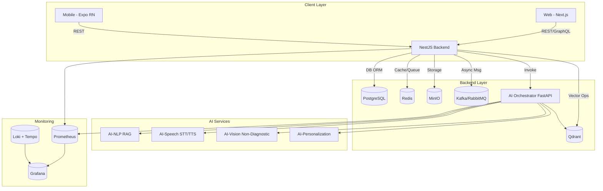
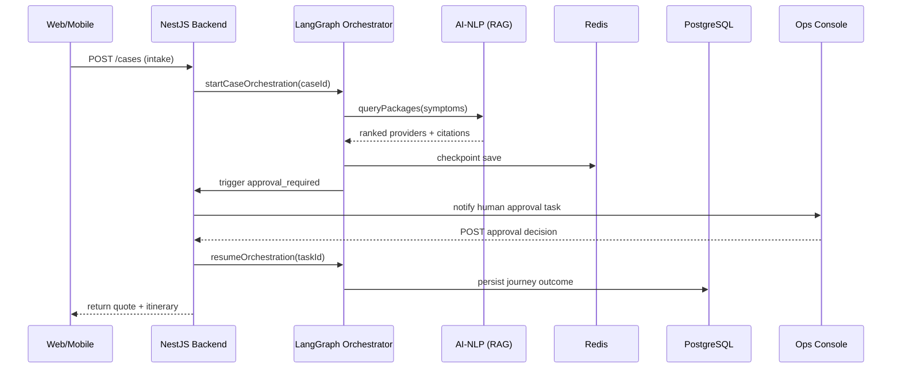

# 🧭 Health Tourism AI Platform — Architecture (Version 2.0 / October 2025)

Unified architecture overview for the Health Tourism AI Platform, a multi-tenant, GDPR/KVKK-compliant system that orchestrates the full medical tourism journey:

**intake → eligibility → provider match → quote → travel/visa → itinerary → aftercare**

---

## 🏗️ Layered Architecture

| Layer | Components | Description |
|-------|-----------|-------------|
| **Frontend Layer** | Next.js 14 (Web), Expo React Native 0.73 (Mobile) | Multi-language patient and operations interfaces |
| **Backend Layer** | NestJS 10 (TypeScript 5.x) | Core business logic, RBAC/ABAC, audit logging, orchestration bridge |
| **AI Services Layer** | FastAPI microservices (Python 3.11) | LangGraph FSM orchestration, RAG retrieval, vision summaries |
| **Data Layer** | PostgreSQL 15, Redis 7, Qdrant 1.11.2, MinIO | Relational, cache, vector storage, documents |
| **Integration Layer** | Kafka, RabbitMQ, Amadeus API, E-Invoice, FHIR/DICOM | External communications |
| **Observability Layer** | Prometheus, Grafana, Loki, Tempo, LangSmith | Metrics, tracing, logging, LLM observability |
| **Infrastructure Layer** | Docker Compose (Local), Kubernetes + Terraform (Production) | Multi-environment deployment |

---

## 🧩 Core System Diagram



---

## 🌐 Networking & Environment Strategy

| Environment | Tooling | Description |
|-------------|---------|-------------|
| **Local** | `docker compose up -d` | Full stack with hot-reload. Uses `.env.local` |
| **Staging** | Docker Compose + `.env.staging` | CI/CD integration tests and manual QA |
| **Production** | Kubernetes + Terraform | Managed secrets, autoscaling, observability |

### Network Configuration:
- **Shared network:** `tourism` (bridge)
- All containers discoverable via DNS:
  - `backend:4000`
  - `orchestrator-svc:8080`
  - `redis:6379`

---

## 🧱 Data Flow



---

## 🔒 Security & Compliance

### Core Security Features
- ✅ **AES-256-GCM field encryption** via `EncryptionService` (tenant & case specific AAD)
- ✅ **Explicit patient consent logging** (KVKK Article 9)
- ✅ **Data retention policies** configurable
- ✅ **JWT + OAuth2 authentication** with scope derivation
- ✅ **Role-based + attribute-based access** (Admin/Clinician/Agent/Patient)
- ✅ **Per-tenant rate limiting** backed by Redis (`rate:{tenant}:{route}`)
- ✅ **Audit trails** in PostgreSQL

### Compliance Standards:
- **KVKK** (Turkish GDPR) compliance
- **GDPR** data protection requirements
- **HIPAA-aligned** for US partnerships
- **ISO 27001** security controls

---

## 🛡️ Resilience Patterns (from v3 Integration)

### Circuit Breaker
- All external calls protected
- States: Closed → Open → Half-Open
- Timeout: 3-5 seconds
- Error threshold: 50%

### Retry Strategy
- Exponential backoff with jitter
- Max attempts: 3-5
- Dead Letter Queue for failed messages

### Idempotency
- `x-idempotency-key` header
- Redis SETNX with TTL (`idem:{sha256(tenant:key)}`)
- Webhook signature verification

### Operational Key Namespaces

| Store | Pattern | Purpose |
|-------|---------|---------|
| Redis | `rate:{tenant}:{route}` | Per-tenant throttling counters |
| Redis | `idem:{sha256}` | Idempotency locks (5-minute TTL) |
| Redis | `cases:fsm:{tenant}:{caseId}` | AES-GCM encrypted orchestration checkpoints |
| Kafka | `events.workflow.*` | Case lifecycle events |

---

## 📈 Observability Setup

| Component | Port | Purpose |
|-----------|------|---------|
| **Prometheus** | 9090 | Metrics collection |
| **Postgres Exporter** | 9187 | Database metrics forwarded via `postgres-exporter` |
| **Redis Exporter** | 9121 | Cache metrics via `redis-exporter` |
| **Grafana** | 3001 | Visualization dashboards |
| **Loki** | 3100 | Log aggregation |
| **Tempo** | 4318 | Distributed tracing |
| **Promtail** | 9080 | Log shipping |
| **LangSmith** | - | LLM observability |

### Key Metrics
- Real-time service health
- API latency (p50, p95, p99)
- Orchestration stage duration
- Error rates and circuit breaker status
- Queue depth and processing lag
- Redis operations per second / cache hit ratio
- Postgres connection saturation and slow query counters

---

## ⚙️ Deployment Flow

### Local Development:
```bash
docker compose up -d
curl http://localhost:4000/api/health
```

### Production Deployment:
```bash
# Terraform infrastructure
terraform apply

# Kubernetes deployment
kubectl apply -f k8s/
```

---

## 🎯 SLO Targets

| Metric | Target |
|--------|--------|
| **API latency (p95)** | < 250 ms |
| **Orchestration completion (p95)** | < 3 s |
| **Error rate** | < 1% |
| **LLM hallucination rate** | < 3% |
| **System availability** | 99.9% |

### Performance Benchmarks:
- Database queries: < 50ms (p95)
- Cache hit rate: > 80%
- AI response time: < 2s (p95)
- API throughput: > 1000 req/s

---

## 🔄 Scalability Strategy

### Horizontal Scaling:
- Backend: 3-10 pods (K8s HPA)
- AI Services: 2-5 pods per service
- Database: Primary + 2 read replicas
- Cache: Redis Cluster (3M/3R)

### Load Balancing:
- Ingress: NGINX Controller
- Internal: Kubernetes Service mesh
- CDN: Cloudflare for static assets

---

## 📊 Component Details

### Backend Modules (NestJS)
- **Core**: Auth, Cases, Providers, Quotes, Bookings
- **Integration**: Doktor365 proxy, Webhooks
- **Infrastructure**: Health, Metrics, Caching

### AI Services (FastAPI)
- **Orchestrator**: LangGraph FSM coordination
- **NLP**: RAG with Qdrant vector search
- **Speech**: Whisper STT + TTS
- **Vision**: Non-diagnostic image analysis

### Data Architecture
- **PostgreSQL**: Core business data with RLS
- **Redis**: Sessions, cache, queues
- **Qdrant**: Semantic search vectors
- **MinIO**: Document storage

---

## 🛡️ Disaster Recovery

### Backup Strategy:
- Database: Daily full + hourly incremental
- Object Storage: Cross-region replication
- Configuration: Git-based IaC

### Recovery Objectives:
- **RTO**: < 1 hour
- **RPO**: < 15 minutes

---

## ✅ Summary

- ✅ **Full 12-factor compliant** containerized architecture
- ✅ **Seamless observability** and compliance integration
- ✅ **Modular structure** for domain-specific AI evolution
- ✅ **Unified local → production parity**
- ✅ **Enterprise-grade security** with encryption and audit
- ✅ **Scalable infrastructure** ready for growth

---

## 📚 Related Documentation

- [Integration Guide v3](ARCHITECTURE_INTEGRATION_V3.md)
- [Deployment Guide](DEPLOYMENT.md)
- [API Reference](API.md)
- [Data Model](DATA_MODEL.md)
- [Security & Compliance](SECURITY.md)

---

**Last Updated:** October 2025  
**Version:** 2.0  
**Status:** Production Ready
