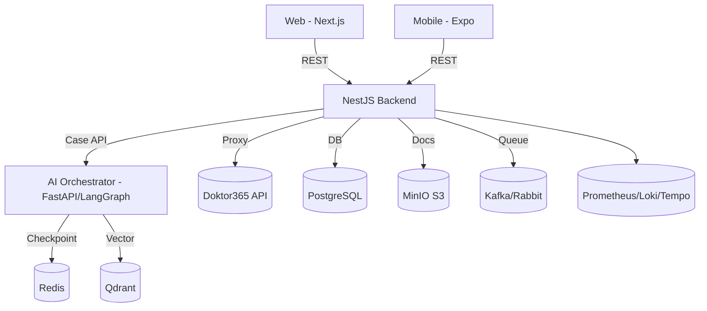

# 🧭 Architecture Integration v3 — Health Tourism AI Platform

**Date:** Oct 2025 • **Scope:** Tourism-only (Doktor365 + AI Orchestration) • **Style:** Secure, event-driven, observable

> Goal: Fintech projesindeki **güvenlik, idempotency, queue** ve **observability** pratiklerini;  
> mevcut Health Tourism AI v2 mimarisine **abartmadan** entegre etmek. Teknoloji stack değişmez; uyarlanır.

---

## 1) Guiding Principles
- **Tourism-first**: Doktor365 + Orchestrator + RAG + MinIO + Qdrant çekirdeği korunur
- **Security-by-design**: JWT + RBAC/ABAC + idempotent webhooks + AES-GCM (PII)
- **Event-driven**: Kafka/Rabbit üzerinden "case lifecycle" olayları
- **Observability**: Prometheus + Grafana + Loki + Tempo
- **Simplicity**: Gerekmeyeni ekleme; geleceğe hazırlık için bağlantı noktaları bırak

---

## 2) High-Level Topology



---

## 3) Component Map (What we add from Fintech)

| Layer | Existing | Integrated (from Fintech) | Why |
|-------|----------|---------------------------|-----|
| Backend | NestJS 10 | ✅ Idempotency middleware (Redis)<br>✅ Circuit breaker/Retry (Axios)<br>✅ Swagger policy blocks | Güvenli API ve dış çağrı stabilitesi |
| Security | JWT/RBAC | ✅ ABAC (CASL attributes)<br>✅ MFA/2FA optional (OIDC hook)<br>✅ Device/Geo heuristic flags | Ek risk kontrolleri |
| Queues | (optional) | ✅ "case.*", "payment.*", "docs.*" topics<br>✅ Retry DLQ | Event-driven işlemler |
| Webhooks | WhatsApp, Payment, e-Fatura | ✅ İmzalı + idempotent + replay-safe | Veri tutarlılığı |
| Observability | Prom+Graf+Tempo+Loki | ✅ Correlated trace-id in logs/metrics<br>✅ SLA panels | Operasyon şeffaflığı |

**Not:** Teknoloji değişmiyor; sadece pratikler ekleniyor.

---

## 4) Backend Surface (NestJS)

### 4.1 Modules
```
backend/src/modules/
  ├─ auth/                  # JWT + OIDC (optional)
  ├─ tenants/               # RLS + tenant context
  ├─ cases/                 # case lifecycle + FSM bridge
  ├─ pricing/               # quote generation
  ├─ travel/                # flight/hotel proxy
  ├─ docs-visa/             # presigned upload + checklist
  ├─ ai-bridge/             # orchestrator client
  ├─ external/doctor365/    # D365 client + proxy endpoints
  ├─ webhooks/              # payments, whatsapp, efatura
  └─ monitoring/            # /metrics + health + otel
```

### 4.2 Doktor365 Proxy Endpoints

| Ours | D365 | Purpose |
|------|------|---------|
| GET /external/d365/deals/:id | /patient/deals/{id} | Deal çek |
| POST /external/d365/deals/:id/notes | /patient/deals/note | Not bırak |
| POST /external/d365/ai/send-flight-data | /patient/ai/send-flight-data | Uçuş aktar |
| GET /external/d365/itinerary/:id | (deal içinden) | Itinerary link |

**Client Rules** (fintech'ten gelen pratikler):
- Axios instance: retry/backoff, circuit-breaker, timeout
- Token cache: `d365:token:{tenant}` (Redis)
- Idempotency: `x-idempotency-key` → Redis `idem:{key}` SETNX TTL 1h

### 4.3 Case API (FSM köprüsü)
- `POST /ai/start-case` → orchestrator `/orchestrate/start`
- `GET /ai/state/:caseId` → `/orchestrate/state/{caseId}`
- `POST /ai/resume-case` → `/orchestrate/resume` (approval kararı ile)

---

## 5) Orchestrator (LangGraph v2, FastAPI)

- **Nodes** (stage eşleşmesi): intake, eligibility, travel, docs_visa, approvals, itinerary, aftercare
- **Tools**: amadeus.py, d365.py, s3.py, qdrant.py
- **Checkpoint**: Redis (key: `lg:ckpt:{caseId}`); never PII
- **Guardrails**: output'a non-diagnostic disclaimer ekle; PHI redaksiyon
- **Observability**: `/metrics` Prometheus, OTEL→Tempo; logs→Loki

---

## 6) Events & Queues

| Topic | Key | Producer → Consumer | When |
|-------|-----|-------------------|------|
| case.created | caseId | Backend → Orchestrator | Intake sonrası |
| approval.required | taskId | Orchestrator → Backend/Ops | Red flag |
| payment.succeeded | bookingId | Payment GW → Backend | Payment webhook |
| doc.uploaded | caseId | Frontend → Backend → Docs | Upload success |
| quote.accepted | caseId | Backend → Orchestrator | Itinerary aşamasına geçiş |

- **DLQ** (dead-letter) pattern kullan (örn. `case.dlq`)
- **Retry policy**: exponential backoff, cap 15m

---

## 7) Security Model

- **JWT**: sub, tenant, roles, perms, exp • **ABAC**: CASL attributes (clinic, region)
- **MFA/2FA** (opsiyonel): OIDC provider (Keycloak/Okta/Azure AD)
- **Rate limiting**: nestjs/throttler (per IP + per tenant)
- **PII/PHI**: AES-GCM (app-level); hash index (email_hash) ile arama
- **Idempotent webhooks**: signature verify + Redis SETNX
- **Consent logging**: consent_logs + retention cron
- **RLS**: `tenant_id = current_setting('app.tenant_id')`

---

## 8) Observability

**Backend**: `/metrics` (HTTP latency, queue sizes, external_call_latency), txn_id ile log/trace linki

**Dashboards**:
- backend-api-latency
- d365-api-calls
- fsm-stage-latency
- red-flag-frequency

**Alert examples**: 5xx spike > 2m, queue backlog > N, orchestrator circuit-breaker open

---

## 9) Redis Canonical Keys (agreed)

```
d365:token:{tenant}                 # Doktor365 access token (TTL=55m)
idem:{hash(x-idempotency-key)}      # Idempotent POST lock (TTL=1h)
lg:ckpt:{caseId}                    # LangGraph checkpoint (JSON)
case:state:{caseId}                 # Backend-exposed state cache (JSON)
rate:{tenant}:{ip}:{route}          # Throttle counters
```

---

## 10) Swagger Surface (minimal list)

- `/api/health`, `/metrics`, `/api/docs`
- `/cases` CRUD (tenant-scoped)
- `/ai/start-case`, `/ai/state/:caseId`, `/ai/resume-case`
- `/external/d365/*` (proxy uçları)
- `/webhooks/*` (payments, whatsapp, efatura) — idempotent

---

## 11) Deployment

- **Local**: `docker compose -f infrastructure/docker/docker-compose.yml up -d`
- **Staging**: K8s (namespaces: backend, ai, infra, monitoring) + ExternalSecret
- **Prod**: Terraform → VPC, EKS, RDS, Elasticache, S3
- **Secrets**: Vault/SSM, never in repo

---

## 12) ENV Keys (delta only, Doktor365 + queue)

```
D365_BASE_URL=
D365_CLIENT_ID=
D365_CLIENT_SECRET=
D365_USERNAME=
D365_PASSWORD=
KAFKA_BROKERS=        # or RABBITMQ_URL
```

---

## 13) Minimal Code Contracts

### Axios client (retry/circuit breaker)
```typescript
// backend/src/modules/external/doctor365/doctor365.client.ts
export const d365 = axios.create({ baseURL: cfg.d365BaseUrl, timeout: 8000 });
d365.interceptors.request.use(async (req) => {
  req.headers.Authorization = `Bearer ${await tokenCache.get()}`;
  return req;
});
// add axios-retry + opossum(circuit-breaker) wrapper
```

### Idempotency middleware
```
// read x-idempotency-key; if exists in Redis -> 409; else SETNX + TTL
```

### FSM call
```python
# orchestrator/tools/d365.py
def get_deal(deal_id: str, tenant: str) -> dict: ...
```

---

## 14) Implementation Checklist

- [ ] external/doctor365 modülü + proxy endpoint'ler
- [ ] Idempotency middleware + Redis anahtarları
- [ ] FSM nodes & Redis checkpoint
- [ ] Swagger tag'leri ve örnekler
- [ ] Prometheus metrics + Grafana panelleri
- [ ] Webhook imzalama + replay kilidi
- [ ] Secrets → ExternalSecret (Vault/SSM)

---

## 15) Validation Runbook (local)

```bash
# 1) docker compose up -d
# 2) curl :4000/api/health && curl :8080/health
# 3) open :4000/api/docs  (Doktor365 proxy görünmeli)
# 4) POST /ai/start-case → approval_required
# 5) Observe Grafana → latency, error, red_flags
```

---

## 🔧 Codex Master Prompt (uygulama için)

**SYSTEM**  
You have write access. You are an AI/Cloud architect (NestJS, FastAPI, Redis, Qdrant, Docker/K8s).

**GOAL**  
Implement Architecture Integration v3: add secure Doktor365 proxy to the backend, wire LangGraph FSM nodes, enable Redis checkpointing and idempotent webhooks, without changing the tourism-focused stack.

**TASKS**

1. **Backend (NestJS)**:
   - Create modules under `backend/src/modules/external/doctor365/*`
   - Add proxy endpoints for D365
   - Implement idempotency middleware
   - JWT + RBAC/ABAC, tenant scoping

2. **Orchestrator (FastAPI)**:
   - Implement nodes: intake, eligibility, travel, docs_visa, approvals, itinerary, aftercare
   - Add tools: d365.py, amadeus.py, s3.py
   - Redis checkpoint with key `lg:ckpt:{caseId}`

3. **Queues & Events**:
   - Topics: case.created, approval.required, payment.succeeded, doc.uploaded
   - Retry/DLQ policies

4. **Observability**:
   - Export `/metrics` and OpenTelemetry traces
   - Add dashboards for API latency, d365 calls, FSM stage latency

5. **Config**:
   - Add env keys: D365_BASE_URL, D365_CLIENT_ID, etc.
   - Update docker-compose health checks

**VALIDATION**
- docker compose up -d works
- /api/health and /api/docs OK
- Orchestrator transitions work
- Grafana dashboards populated

---

*Last Updated: October 2025*  
*Version: 3.0.0*