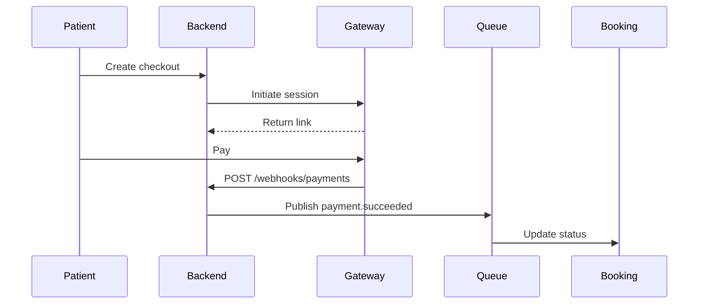

# 🔗 Integrations – Health Tourism AI Platform (Version 2.1 / December 2025)

The **Health Tourism AI Platform** securely integrates with external APIs and services for travel, communication, compliance, and payments — now extended with **idempotency**, **queue events**, and **observability tracing** as of v2.1.

All integrations comply with **KVKK/GDPR**, **AES-GCM encryption**, and **idempotent webhook** standards.

-----

## 💬 WhatsApp Cloud API

| Attribute | Details |
|-----------|----------|
| **Webhook** | `/webhooks/whatsapp` |
| **Auth** | HMAC-SHA256 via `X-Hub-Signature-256` |
| **Cache** | Redis → `whatsapp:access_token` |
| **Event** | Publishes `whatsapp.inbound` to queue |
| **Rate Limits** | 1000 messages/day per number |

### Features

  - Outbound & inbound message flows via `comms.module.ts`
  - Token auto-refresh and caching (TTL 1h)
  - Context-aware orchestration with Orchestrator FSM
  - PHI masking + consent validation
  - Observability: metrics & traces exported to Prometheus/Tempo

-----

## ✈️ Amadeus Flight Offers (Sandbox)

| Attribute | Details |
|-----------|----------|
| **Auth** | OAuth2 client credentials |
| **Cache** | Redis → `amadeus:token` (TTL 55m) |
| **Retries** | 3x exponential backoff |
| **DLQ Topic** | `amadeus.errors` |
| **Trace Tag** | `otel.span="integration_call"` |

### Flow

1.  Acquire or reuse cached access token.
2.  Query `/v2/shopping/flight-offers`.
3.  Transform itineraries to normalized schema.
4.  Log metrics: `integration_request_duration_seconds{provider="amadeus"}`

-----

## 🏥 HAPI-FHIR / Orthanc / Doktor365 Proxy

| Component | Purpose |
|------------|----------|
| **FHIR Adapter** | Fetch structured data (Patient, Observation, ImagingStudy) |
| **Orthanc DICOM** | Anonymized imaging for AI Vision |
| **Doktor365 Proxy** | Connects Orchestrator FSM ↔ Clinic API securely |

### Highlights

  - Redis cache for FHIR tokens (`fhir:token:{tenant}`)
  - Doktor365 client supports:
      - `/deals/:id`
      - `/ai/send-flight-data`
      - `/itinerary/:id`
  - Circuit breaker (axios-opossum) + Retry (axios-retry)
  - Token scoped to tenant → `d365:token:{tenant}`

-----

## 💳 Payment Gateway Integration

| Attribute | Details |
|-----------|----------|
| **Providers** | Stripe / Iyzico |
| **Webhook** | `/webhooks/payments` |
| **Idempotency** | `x-idempotency-key` (Redis TTL 24h) |
| **Queue Event**| `payment.succeeded` |
| **Audit Trail** | Logged in `audit_logs` |

### Flow



-----

## 🧾 E-Fatura (Turkish e-Invoice System)

| Attribute | Details |
|-----------|----------|
| **Webhook** | `/webhooks/efatura` |
| **API** | GİB e-Fatura |
| **Queue** | `efatura.status.update` |
| **Retention** | 10 years |
| **Storage** | MinIO (`invoices/{ettn}.pdf`) |

### Flow

  - Invoice submission → `EfaturaClient.queueInvoice()`
  - Async status via webhook (approved/rejected)
  - PDF stored in MinIO; metadata in PostgreSQL

-----

## 🏛 USHAŞ / HealthTürkiye Integration

| Attribute | Details |
|-----------|----------|
| **API Base**| `https://api.healthturkiye.gov.tr/v1` |
| **Auth** | API Key (Vault-managed) |
| **Cache** | Redis → `ushas:providers` |
| **Schedule**| Sync every 6h |
| **Event** | `ushas.sync.completed` |

### Features

  - Catalog importer merges HealthTürkiye providers with internal catalog.
  - Supports multi-language package data.
  - Observability metrics via `integration_requests_total{provider="ushas"}`.

-----

## 🗂 MinIO S3 Document Exchange

| Attribute | Details |
|-----------|----------|
| **Bucket** | `health-tourism-docs` |
| **Upload** | `/docs-visa/presign` |
| **Encryption**| AES256 + SSE |
| **Expiry** | 15 minutes |
| **Versioning**| Enabled |
| **Audit** | Access events stored via MinIO event bus |

### File Paths

`docs/{tenant}/{caseId}/{file}`

### Rules

  - Only presigned uploads permitted for patients.
  - Temporary GET URLs for staff.
  - Auto-expiration after 180 days.

-----

## 🧩 Integration Event Schema

| Event | Source | Destination | Payload Example |
|-----------------------|-------------------|-------------------------|--------------------------------------|
| `whatsapp.inbound` | WhatsApp | Backend → Orchestrator | `{ "caseId", "message", "lang" }` |
| `payment.succeeded` | Gateway | Backend → Queue | `{ "bookingId", "amount", "currency" }` |
| `efatura.status.update` | E-Fatura | Backend | `{ "invoiceId", "status" }` |
| `travel.offer.generated`| Amadeus | Orchestrator | `{ "caseId", "flights[]", "total" }` |
| `ushas.sync.completed` | Catalog Importer | Backend | `{ "providers[]", "timestamp" }` |

-----

## 📊 Integration Monitoring

### Prometheus Metrics

```
integration_requests_total{provider="whatsapp",status="success"} 1400
integration_request_duration_seconds{provider="amadeus"} 0.932
integration_errors_total{provider="efatura",error_type="timeout"} 2
```

### Observability

  - **Traces**: `otel.span="integration_call"` with correlation IDs
  - **Logs**: JSON logs → Loki
  - **Metrics**: Exported to Prometheus
  - **Dashboards**: Grafana “Integration Latency & Errors”

-----

## ✅ Summary

  - 🔐 Idempotent webhooks across all providers
  - 📡 Queue-driven event propagation
  - 🧠 Orchestrator FSM-linked external integrations
  - 🧾 Full KVKK/GDPR + PCI compliance
  - 🧩 Observability via Prometheus, Tempo, and Loki

-----

**Maintained by:** Integration & Backend Teams  
**Version:** 2.1 – December 2025  
**Status:** Production Ready