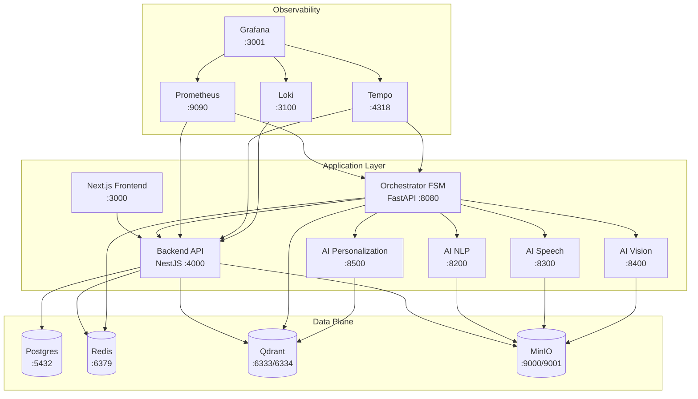

# Health Tourism AI Platform Docker Stack

The compose stack models the October 2025 Health Tourism AI Platform (v2) target architecture. All containers share the `tourism` bridge network and can run in **local** (default) or **prod** mode via the `NODE_ENV` variable.

## Architecture Overview



## Service Endpoints

| Service | Port(s) | Purpose |
| --- | --- | --- |
| postgres | 5432 | Primary transactional database |
| redis | 6379 | Caching, queues, and rate limiting |
| qdrant | 6333 / 6334 | Vector search and embeddings store |
| minio | 9000 / 9001 | Object storage + console |
| backend | 4000 | NestJS API gateway |
| orchestrator-svc | 8080 | FastAPI orchestration FSM |
| frontend | 3000 | Next.js web client |
| ai-nlp | 8200 | Retrieval-augmented NLP pipeline |
| ai-speech | 8300 | Speech enrichment and TTS/STT |
| ai-vision | 8400 | Vision triage pre-evaluation |
| ai-personalization | 8500 | Personalized recommendation engine |
| prometheus | 9090 | Metrics collection |
| grafana | 3001 | Observability dashboards |
| loki | 3100 | Log aggregation |
| tempo | 4318 | Distributed tracing ingest |

> Health checks are defined for every core service so `depends_on` waits for ready containers. Source directories are bind-mounted in local mode for hot reload; production runs rely on the run stages of multi-stage Dockerfiles.

## Environment & Startup

1. Copy the baseline environment file and customise it for local development:

   ```bash
   cp .env.example .env.local
   ```

2. Launch the stack (defaults to `NODE_ENV=local`):

   ```bash
   docker compose -f infrastructure/docker/docker-compose.yml up -d
   ```

3. For a production build, create `.env.prod` and set the environment before starting:

   ```bash
   export NODE_ENV=prod
   docker compose -f infrastructure/docker/docker-compose.yml up -d --build
   ```

## Notes

- The `COMPOSE_PROJECT_NAME` env var scopes container names (default prefix `tourism`).
- Prometheus scrapes the backend/orchestrator by default; extend `monitoring/prometheus.yml` for additional targets.
- Grafana auto-provisions dashboards and data sources from `monitoring/grafana`.
